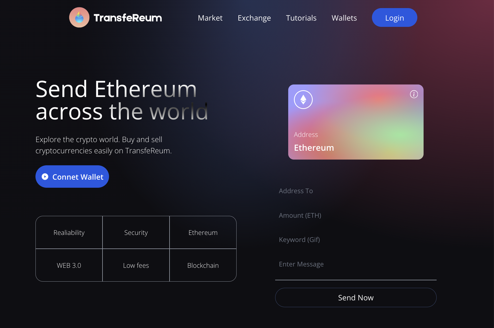
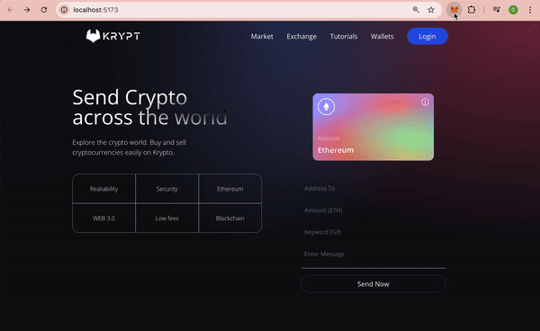

## Web3.0 Blockchain Application

### Overview
This project is a decentralized that ineracts with the Ehtereum blockchain. It  demonstrates the integration of Ethereum smart contracts with a React-based frontend, where users can send transactions and view transaction history.

### Tech Stack
- Vite.js React, JavaScript, TailwindCSS
- Ethereum, Solidity, Hardhat, Alchemy (Sepolia test network)
- Development Tools: Node.js, npm, nvm

### Description
- Users can connect their MetaMask wallet to the application to start interacting with the blockchain. They can send Ethereum transactions to other addresses directly from the app.
- Smart contracts are written in Solidity and managed by Hardhat. They are responsible for the core blockchain logic of the application.
- Application provides real-time updates as well as a history of transactions by specific address. 
- Each transaction is paired with a GIF fetched from the Giphy API based on the user’s input keyword.

### Demo
- Landing Page

- Step 1: Connect to MetaMask wallet

- Step 2: Send Ethereum transaction

- Step 3: Track previous transaction history
